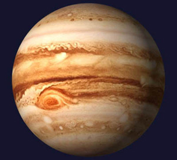

# Direzione scelta: Atlante solare

## Esperienza approvata

- Design: **Atlante solare**.
- Palette predefinita: **Ametista solare**.
- Movimento: **Orbite inclinate**.
- Nucleo: texture ispirata alla **Singolarità editoriale**, reinterpretata in rosso, arancio e giallo caldo.
- Frase principale: **“Benvenuto nel mio Universo Lavorativo. La raccolta definitiva delle abilità professionali e non.”**

## Navigazione gerarchica

La landing è la mappa dell’universo. Ogni cartella in `content/landing/` produce un pianeta; premendo il pianeta si apre la pagina della sezione corrispondente. Dentro quella pagina, ogni JSON con prefisso numerico produce un nuovo pianeta selezionabile con titolo, descrizione, tag e collegamento di approfondimento. I file `head-*` guidano la testata della pagina e quelli con `-` iniziale vengono ignorati.

Ogni pianeta parte alla propria dimensione base, incluso il primo con indice `0`, e si espande soltanto durante hover o focus. Nelle pagine interne, la chiusura del popup avvia sempre un nuovo countdown completo di due secondi; se il popup viene riaperto prima della fine, i timer precedenti vengono annullati. La pausa manuale resta l’unica condizione che impedisce il countdown alla chiusura.

Il menu laterale rende sempre visibili:

1. selettore della palette;
2. collegamento alla Landing;
3. una voce per ogni cartella generata;
4. numero di JSON-pianeta attivi presenti nella sezione.

Su schermi piccoli palette e navigazione diventano due righe orizzontali controllate da frecce. Il trascinamento laterale è disabilitato per evitare conflitti con lo scorrimento della pagina e con la scena WebGL.

## Palette

Sono mantenute tutte le cinque combinazioni del laboratorio:

- Terra Cotta;
- Oro notturno;
- Cobalto corallo;
- Salvia rame;
- Ametista solare, predefinita.

La palette modifica l’intera interfaccia e la scena WebGL: sfondo, pannelli, testi, accenti, luci, stelle, orbite e texture procedurali delle sfere. La preferenza viene salvata in `localStorage`; una nuova visita senza preferenze parte da Ametista solare.

## Trattamento tridimensionale

Sole e pianeti sono geometrie sferiche reali. Le texture procedurali avvolgono le superfici a 360° e cambiano con la palette. Ogni pianeta usa un piano orbitale indipendente sugli assi X, Y e Z, con velocità e direzione proprie.

### Texture planetarie: riferimento Giove

La superficie dei pianeti prende **Giove** come riferimento visivo: fasce atmosferiche orizzontali di larghezza irregolare, filamenti mossi, piccole turbolenze e una macchia ellittica simile a una grande tempesta. Il riferimento riguarda esclusivamente la struttura della texture; i colori continuano a provenire dalla palette attiva.

Con **Ametista solare** vengono quindi mantenuti il fondo `#12091b` e i colori planetari definiti in `palette.ts` (`#e06450`, `#8e65b8`, `#ff9950`, `#6e416f`, `#d95566`, `#a47bd1`). Il materiale resta completamente opaco; fasce e vortici hanno un contrasto leggermente superiore rispetto al fondo. Una componente emissiva molto contenuta li rende leggibili anche sul lato in ombra, senza appiattire la luce direzionale proveniente dal sole.

L'immagine è stata fornita dall'utente come riferimento della direzione grafica. La resa finale non la usa come texture: viene generata proceduralmente nel canvas WebGL, così può essere ricolorata automaticamente per tutte le palette e avvolta sulle sfere a 360°.

I pianeti usano una scala maggiore rispetto alla prima versione. Il nome è proiettato sul centro della sfera in giallo caldo, va a capo e si ridimensiona in base al diametro visibile; non sono presenti numero progressivo, bordo o pannello di sfondo. Il pianeta stesso resta quindi lo sfondo dell'etichetta. Ombra scura e alone molto contenuto mantengono il testo leggibile sulle zone chiare e su quelle in ombra.

### Distanza di sicurezza delle orbite

Ogni pianeta occupa una shell sferica concentrica distinta. Tra due shell adiacenti la distanza radiale è calcolata come somma dei raggi massimi dei pianeti, includendo l'ingrandimento da selezione, più il diametro completo di un pianeta base. Rimane quindi sempre almeno “un pianeta vuoto” tra le due superfici, qualunque siano inclinazione, fase e direzione delle orbite.

Gli assi orbitali vengono distribuiti usando l'angolo aureo, un nodo ascendente distinto e inclinazioni alternate. L'apertura iniziale della camera, il reset e il limite massimo dello zoom si adattano al numero di contenuti, così l'aumento delle distanze non blocca l'esplorazione delle shell più esterne.

Interazioni disponibili:

- trascinamento per ruotare la camera a 360°;
- rotella o trackpad per lo zoom;
- ray casting per selezionare direttamente le sfere;
- etichette HTML proiettate sulle coordinate 3D;
- frecce, tasti `+`/`-` e `Home` per la tastiera;
- supporto a `prefers-reduced-motion` e fallback senza WebGL.

I comandi di rotazione della camera adottano il design **Coordinate stellari**, condiviso con le frecce dei menu mobile. Il pulsante Reset è centrato sul loro asse verticale e usa due emissioni laterali ametista. Alla sua destra, `II` mette in pausa manualmente il cosmo e diventa un triangolo arancione quando è possibile riprendere la rotazione. La scorciatoia globale alla landing usa invece il design **Cometa radente**.

Nelle pagine interne la selezione di un pianeta ferma la rotazione e apre il contenuto in un popup responsive. La chiusura usa una X arancione con scia di fuoco; il cosmo riparte dopo un conto alla rovescia di due secondi. Misure, interazioni e accessibilità sono descritte in [Popup dei pianeti e pausa cosmica](planet-detail-popup.md).

## Scelte tecniche

- Three.js `0.180.0` incluso nel bundle Angular.
- Pixel ratio massimo `2` per controllare il costo GPU.
- Nessuna texture remota obbligatoria.
- Prerender Angular con inizializzazione WebGL solo nel browser.
- Artefatti statici compatibili con GitHub Pages.

## File principali

- `custom-portfolio-app/content/landing/`: gerarchia editoriale.
- `custom-portfolio-app/scripts/generate-experiences.mjs`: generatore e validazione.
- `custom-portfolio-app/src/app/pages/landing/landing-page.*`: landing e pagine delle sezioni.
- `custom-portfolio-app/src/app/pages/landing/orbital-scene.*`: scena WebGL.
- `custom-portfolio-app/src/app/shared/navbar/*`: menu e selettore palette.
- `custom-portfolio-app/src/app/theme/palette.ts`: definizioni e persistenza delle palette.
