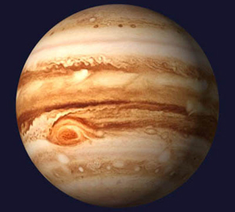

# Direzione scelta: Atlante solare

## Esperienza approvata

- Design: **Atlante solare**.
- Palette predefinita: **Ametista solare**.
- Movimento: **Orbite inclinate**.
- Nucleo: texture ispirata alla **Singolarità editoriale**, reinterpretata in rosso, arancio e giallo caldo.
- Frase principale: **“Benvenuto nel mio Universo Lavorativo. La raccolta definitiva delle abilità professionali e non.”**

## Navigazione gerarchica

La landing è la mappa dell’universo. Ogni cartella in `content/landing/` produce un pianeta; premendo il pianeta si apre la pagina della sezione corrispondente. Dentro quella pagina, ogni JSON con prefisso numerico produce un nuovo pianeta selezionabile con titolo, descrizione, tag e collegamento di approfondimento. I file `head-*` guidano la testata della pagina e quelli con `-` iniziale vengono ignorati.

Ogni pianeta parte alla propria dimensione base, incluso il primo con indice `0`, e si espande soltanto durante hover o focus. Nelle pagine interne, la chiusura del popup avvia sempre un nuovo countdown completo di due secondi; se il popup viene riaperto prima della fine, i timer precedenti vengono annullati. La pausa manuale resta l’unica condizione che impedisce il countdown alla chiusura.

Il menu laterale rende sempre visibili:

1. selettore della palette;
2. collegamento alla Landing;
3. una voce per ogni cartella generata;
4. numero di JSON-pianeta attivi presenti nella sezione.

La pagina selezionata usa un contenitore più tondeggiante, derivato dal mockup Via Lattea: superficie sfumata della palette, bordo leggero e una breve emissione arancione sul lato sinistro. Su mobile lo stesso stato diventa una pillola completa, mantenendo le frecce **Coordinate stellari** e lo scorrimento controllato già approvati.

Su schermi piccoli palette e navigazione diventano due righe orizzontali controllate da frecce. Il trascinamento laterale è disabilitato per evitare conflitti con lo scorrimento della pagina e con la scena WebGL.

## Palette

Sono mantenute tutte le cinque combinazioni del laboratorio:

- Terra Cotta;
- Oro notturno;
- Cobalto corallo;
- Salvia rame;
- Ametista solare, predefinita.

La palette modifica l’intera interfaccia e la scena WebGL: sfondo, pannelli, testi, accenti, luci, stelle, orbite e texture procedurali delle sfere. La preferenza viene salvata in `localStorage`; una nuova visita senza preferenze parte da Ametista solare.

## Trattamento tridimensionale

Sole e pianeti sono geometrie sferiche reali. Le texture procedurali avvolgono le superfici a 360° e cambiano con la palette. Ogni pianeta usa un piano orbitale indipendente sugli assi X, Y e Z, con velocità e direzione proprie.

### Texture planetarie: riferimento Giove

La superficie dei pianeti prende **Giove** come riferimento visivo: fasce atmosferiche orizzontali di larghezza irregolare, filamenti mossi, piccole turbolenze e una macchia ellittica simile a una grande tempesta. Il riferimento riguarda esclusivamente la struttura della texture; i colori continuano a provenire dalla palette attiva.

Con **Ametista solare** vengono quindi mantenuti il fondo `#12091b` e i colori planetari definiti in `palette.ts` (`#e06450`, `#8e65b8`, `#ff9950`, `#6e416f`, `#d95566`, `#a47bd1`). Il materiale resta completamente opaco; fasce e vortici hanno un contrasto leggermente superiore rispetto al fondo. Una componente emissiva molto contenuta li rende leggibili anche sul lato in ombra, senza appiattire la luce direzionale proveniente dal sole.

L'immagine è stata fornita dall'utente come riferimento della direzione grafica. La resa finale non la usa come texture: viene generata proceduralmente nel canvas WebGL, così può essere ricolorata automaticamente per tutte le palette e avvolta sulle sfere a 360°.

I pianeti usano una scala maggiore rispetto alla prima versione. Il nome è proiettato sul centro della sfera in giallo caldo, va a capo e si ridimensiona in base al diametro visibile; non sono presenti numero progressivo, bordo o pannello di sfondo. Il pianeta stesso resta quindi lo sfondo dell'etichetta. Ombra scura e alone molto contenuto mantengono il testo leggibile sulle zone chiare e su quelle in ombra.

### Distanza di sicurezza delle orbite

Ogni pianeta occupa una shell sferica concentrica distinta. Tra due shell adiacenti la distanza radiale è calcolata come somma dei raggi massimi dei pianeti, includendo l'ingrandimento da selezione, più il diametro completo di un pianeta base. Rimane quindi sempre almeno “un pianeta vuoto” tra le due superfici, qualunque siano inclinazione, fase e direzione delle orbite.

Gli assi orbitali vengono distribuiti usando l'angolo aureo, un nodo ascendente distinto e inclinazioni alternate. L'apertura iniziale della camera, il reset e il limite massimo dello zoom si adattano al numero di contenuti, così l'aumento delle distanze non blocca l'esplorazione delle shell più esterne.

Interazioni disponibili:

- trascinamento per ruotare la camera a 360°;
- rotella o trackpad per lo zoom;
- ray casting per selezionare direttamente le sfere;
- etichette HTML proiettate sulle coordinate 3D;
- frecce, tasti `+`/`-` e `Home` per la tastiera;
- supporto a `prefers-reduced-motion` e fallback senza WebGL.

I comandi di rotazione della camera adottano il design **Coordinate stellari**, condiviso con le frecce dei menu mobile. Il pulsante Reset è centrato sul loro asse verticale e usa due emissioni laterali ametista. Alla sua destra, `II` mette in pausa manualmente il cosmo e diventa un triangolo arancione quando è possibile riprendere la rotazione. La scorciatoia globale alla landing usa invece il design **Cometa radente**.

Nelle pagine interne la selezione di un pianeta ferma la rotazione e apre il contenuto in un popup responsive. La chiusura usa una X arancione con scia di fuoco; il cosmo riparte dopo un conto alla rovescia di due secondi. Misure, interazioni e accessibilità sono descritte in [Popup dei pianeti e pausa cosmica](planet-detail-popup.md).

## Sfondo Via Lattea degli approfondimenti

Tutte le rotte `/approfondimenti/*` caricano come sfondo un unico asset statico: `custom-portfolio-app/public/webgl/milky-way-background.js`. L'asset usa direttamente WebGL e shader procedurali, quindi non dipende da immagini remote o da una seconda copia di Three.js. Disegna una fascia galattica rotante, stelle, otto orbite, il Sole e otto pianeti illuminati come sfere tridimensionali; Giove presenta fasce e tempesta, mentre Saturno mantiene il sistema di anelli.

Il sistema legge `--deep`, `--text-main`, `--accent`, `--accent-hot`, `--secondary` e `--page-bg` dalle variabili CSS. Un `MutationObserver` controlla `data-palette` sull'elemento radice: quando l'utente sceglie una nuova palette, stelle, galassia, Sole, pianeti e orbite vengono ricolorati immediatamente senza ricaricare la pagina. Sulle palette chiare l'opacità del canvas viene ridotta automaticamente per conservare il contrasto editoriale.

Il canvas è fisso dietro al contenuto, non intercetta puntatore o tastiera e viene montato soltanto nel browser. `ResizeObserver` aggiorna il buffer quando cambia il viewport, `IntersectionObserver` evita rendering utile quando il canvas non è visibile, il pixel ratio è limitato a `1.5` e `prefers-reduced-motion` produce un fotogramma statico. Uscendo dalla pagina vengono annullati i frame e rilasciate le risorse WebGL.

### Dati NASA usati come riferimento

La scena conserva l'ordine riconosciuto degli otto pianeti — Mercurio, Venere, Terra, Marte, Giove, Saturno, Urano e Nettuno — e usa le dimensioni relative pubblicate dalla NASA come riferimento per distinguere pianeti terrestri, giganti gassosi e giganti ghiacciati. Raggi e distanze nel fondale sono intenzionalmente compressi: una scala astronomica reale renderebbe i pianeti illeggibili dietro ai testi.

Fonti consultate:

- [NASA Science — About the Planets](https://science.nasa.gov/solar-system/planets/): ordine, categorie e caratteristiche visive generali;
- [NASA Science — Solar System Sizes](https://science.nasa.gov/resource/solar-system-sizes/): raggi relativi dei pianeti;
- [NASA Science — Solar System Facts](https://science.nasa.gov/solar-system/solar-system-facts/): distinzione tra pianeti terrestri, giganti gassosi e giganti ghiacciati.

Le texture non copiano fotografie NASA: sono calcolate dagli shader e reinterpretate usando esclusivamente i colori della palette selezionata.

### Stelle stabili e anelli realistici

Il campo stellare adotta il design **Deep field puntiforme**. Ogni stella è un punto circolare sub-pixel con dimensione, luminosità e temperatura cromatica leggermente differenti ma stabili nel tempo. La luminosità massima resta volontariamente sotto quella degli accenti dell'interfaccia, così le stelle costruiscono profondità senza competere con titoli e testi. Non viene applicato alcun lampeggio: secondo la NASA lo scintillio osservato dalla Terra deriva dalle turbolenze atmosferiche, mentre dallo spazio la luce stellare appare stabile.

Sono state considerate tre direzioni per il campo stellare:

1. **Deep field puntiforme**, scelto e implementato: punti radi, stabili, dimensioni variabili e lievissime differenze calde/fredde;
2. **Campo fotografico rarefatto**: molte meno stelle, più luminose e con maggior contrasto, ma potenzialmente troppo presenti dietro ai testi;
3. **Polvere galattica granulare**: moltissimi punti quasi invisibili, adatta a una nebulosa ma meno leggibile come cielo stellato.

Gli anelli di Saturno non sono più un disco pieno. Lo shader separa lato posteriore e lato anteriore rispetto al pianeta, riduce fortemente lo spessore prospettico e costruisce numerose fasce sottili con densità diverse. Sono presenti una lacuna principale ispirata alla **Divisione di Cassini** tra gli anelli A e B e una seconda separazione più fine ispirata alla lacuna di Encke. Colore e luminosità restano legati alla palette, mentre la struttura segue le osservazioni NASA: anelli estremamente sottili composti da moltissime particelle prevalentemente ghiacciate, non una superficie solida.

Fonti aggiuntive:

- [NASA Science — Saturn's Rings](https://science.nasa.gov/resource/saturns-rings-2/): struttura degli anelli principali e Divisione di Cassini;
- [NASA Science — Saturn Facts](https://science.nasa.gov/saturn/facts/): spessore, composizione e ordine dei sistemi di anelli;
- [NASA Hubble — Why Have a Telescope in Space?](https://science.nasa.gov/mission/hubble/overview/why-have-a-telescope-in-space/): stabilità della luce stellare sopra l'atmosfera terrestre.

## Scelte tecniche

- Three.js `0.180.0` incluso nel bundle Angular.
- Pixel ratio massimo `2` per controllare il costo GPU.
- Nessuna texture remota obbligatoria.
- Prerender Angular con inizializzazione WebGL solo nel browser.
- Artefatti statici compatibili con GitHub Pages.

### Adattamento UHD e 4K

Il layout 1080p e mobile resta quello di riferimento. Quando il viewport disponibile raggiunge almeno `2560 × 1300` CSS pixel, una media query dedicata attiva la modalità UHD: il contenitore editoriale passa da `1480px` a un massimo di `2800px`, la sidebar cresce in proporzione e la scena orbitale occupa tra `920px` e `1320px` di altezza. Anche la scala tipografica aumenta leggermente.

L'ingrandimento della scena WebGL avviene aumentando il suo viewport reale, non applicando una trasformazione grafica al canvas. Three.js riceve le nuove dimensioni tramite `ResizeObserver`, aggiorna rapporto prospettico e buffer di rendering e mantiene corretti selezione, ray casting ed etichette HTML. Il sistema appare quindi più vicino e leggibile su monitor 4K e TV, senza alterare camera e composizione sui display 1080p o sui dispositivi mobili.

La soglia usa i pixel CSS effettivamente disponibili nel browser, non il numero nominale di pixel fisici. Un display 4K con ridimensionamento di sistema elevato che espone uno spazio equivalente a 1080p conserva intenzionalmente il layout 1080p.

### Universo a viewport intero

Le pagine planetarie (`/` e `/universo/*`) occupano esattamente il viewport disponibile. La shell elimina padding esterni, larghezza massima, bordo, angoli arrotondati e ombra della precedente card orbitale. L'intestazione resta sopra alla scena in una fascia compatta: identifica l'area corrente, mostra il titolo e conserva sia la descrizione editoriale sia la breve guida. Tutto lo spazio verticale rimanente viene assegnato al canvas WebGL.

Il canvas WebGL copre l'intera superficie della pagina planetaria, comprese le aree sotto intestazione e nota inferiore. Questi contenuti non interrompono quindi il cosmo con fondi statici: sono livelli editoriali semitrasparenti, con gradienti e ombre testuali leggere per mantenere il contrasto. Orbite, stelle e pianeti continuano a muoversi e rispondono alla rotazione anche dietro ai testi. Indicatori di stato e controlli ricevono offset responsive dedicati per non sovrapporsi all'intestazione o alla nota inferiore.

Su desktop la pagina usa `100dvh` accanto alla sidebar fissa. Su mobile il contenitore principale diventa l'elemento flessibile residuo sotto al menu: la sua altezza viene quindi calcolata dal browser senza valori fissi legati a un singolo telefono. Il titolo e i testi riducono scala e spaziatura; la guida è limitata a due righe e la nota inferiore, già rappresentata dai controlli della scena, viene nascosta. Il canvas non impone più un'altezza minima: può adattarsi allo spazio reale disponibile senza generare una barra di scorrimento verticale.

Poiché sul telefono il canvas ora usa anche l'altezza occupata in precedenza dalle fasce editoriali, la distanza iniziale della camera viene moltiplicata per `1.45` sotto i `680px`. Il sistema solare risulta leggermente più lontano, lascia più aria ai margini e mostra meglio le orbite esterne; reset e limiti di zoom rispettano la stessa distanza responsive. Desktop e UHD mantengono la camera originale.

Il comportamento è stato verificato a 1280×720, in un viewport mobile da 390×844 e in un viewport UHD da 3840×2160. In tutti i casi l'altezza del documento coincide con quella del viewport e la scena conserva i controlli all'interno dell'area visibile. Le pagine editoriali di approfondimento e riferimenti non adottano questo blocco dello scorrimento e mantengono il proprio flusso verticale.

## File principali

- `custom-portfolio-app/content/landing/`: gerarchia editoriale.
- `custom-portfolio-app/scripts/generate-experiences.mjs`: generatore e validazione.
- `custom-portfolio-app/src/app/pages/landing/landing-page.*`: landing e pagine delle sezioni.
- `custom-portfolio-app/src/app/pages/landing/orbital-scene.*`: scena WebGL.
- `custom-portfolio-app/src/app/shared/navbar/*`: menu e selettore palette.
- `custom-portfolio-app/src/app/theme/palette.ts`: definizioni e persistenza delle palette.
- `custom-portfolio-app/public/webgl/milky-way-background.js`: sfondo WebGL statico e palette-aware degli approfondimenti.
- `custom-portfolio-app/src/app/pages/details/detail-page.*`: caricamento, contenuti e sovrapposizione editoriale degli approfondimenti.
